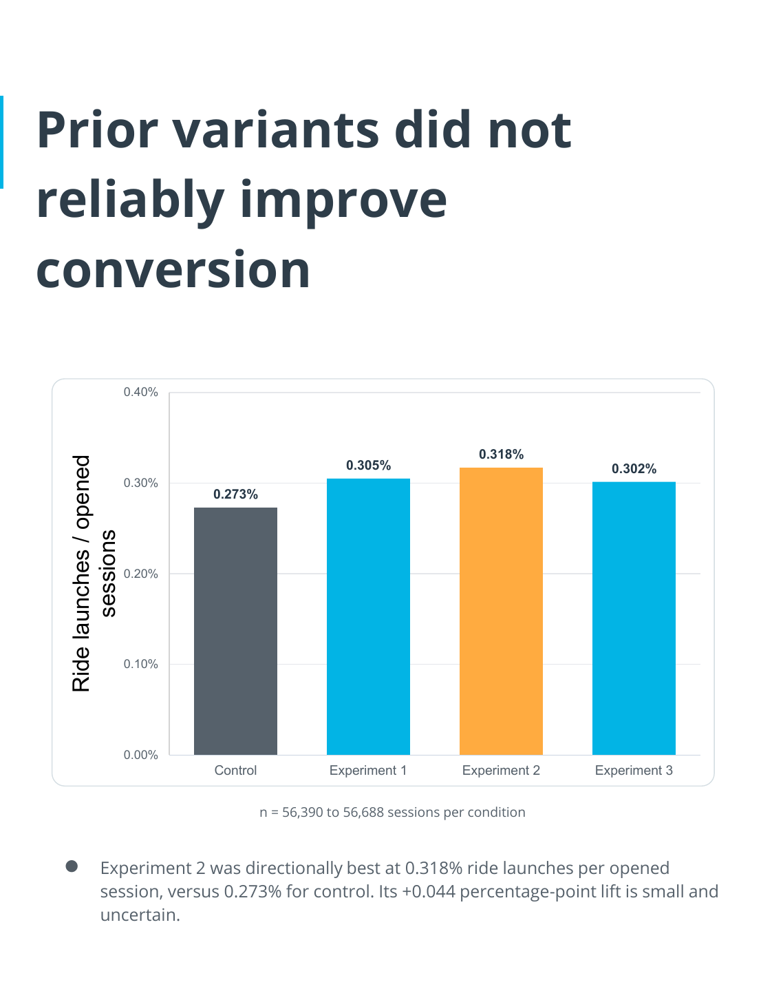
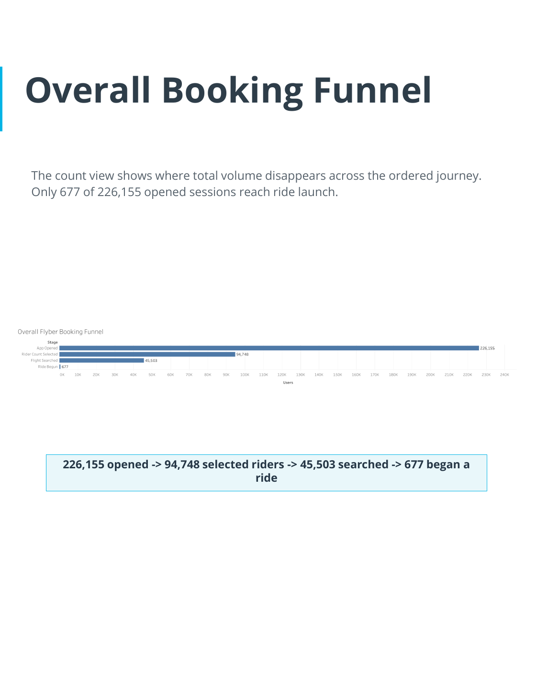

# Data Product Manager Portfolio

Three Flyber data-product projects spanning MVP launch strategy, iterative product experimentation, and a scalable data platform for sustained growth.

## Projects

### P1. [Flyber MVP Launch Strategy](flying-taxi-business-case/)

High-level goal: Use comparable New York City taxi data and user research to identify the customer problem, test launch hypotheses, and propose an evidence-based MVP strategy for a flying-taxi service.

Technologies used: product discovery, market analysis, SQL, Python, Tableau, spatial analysis, temporal analysis, user research, MVP strategy.

### P2. [Iterative Design and the Future of Flyber](iterative-design-plan/)

High-level goal: Evaluate a multivariate experiment, diagnose funnel and cohort underperformance, synthesize qualitative rider evidence, and design the next statistically valid product test.

Technologies used: product analytics, KPI design, multivariate testing, Welch t-tests, Holm adjustment, funnel analysis, cohort analysis, qualitative research, Tableau.

### P3. [Flyber Scalable Data Strategy](scalable-data-strategy/)

High-level goal: Define the stakeholders, data model, ETL controls, growth analysis, and cloud warehouse strategy required to scale Flyber’s rider-event data platform.

Technologies used: data strategy, stakeholder analysis, relational data modeling, ETL, data-quality reconciliation, Python, Excel, Matplotlib, BigQuery.

